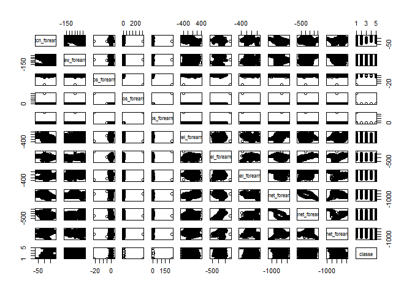

# Prediction of exercise quality from activity monitors data
June 20 2015  

##Executive Summary
It is easy to quantify how much exercise a person has finished however it is not a trivial to evaluate how well a person exercises. This report describes a model that predicts the quality of an exercise performed by a human being. The model is built on the data collected from accelerometers on the belt, forearm, arm, and dumbell of 6 participants with an out of sample error about 0.013.
[Reference](http://groupware.les.inf.puc-rio.br/har) 

##1. Download and read data
(Thanks for the discussion forum!) The data contain 3 different forms of NA: NA, blank, #DIV/0!. In reading data step, I changed them into one form "NA".


##2. Clean data
I cleaned the data by 3 steps to only include variables that are potential predictors for modeling. Since a number of columns in pml_training data contain high number of NA value, my first step is to remove these columns (containing more than 80% of NAs) from the data. My second step is to remove redundant variables i.e. the varibales start with "total", which are just addups of other variables and give no new information to the model. The third step is to exclude descriptive variables that are soly used to distinghush different users or to label the time or the features of the exercises. 


```r
##step 1: remove the column with over 80% NA
miss<-colSums(is.na(pmltrain))
index<-miss>0.8*19622 ##find the columns with over 80% NA
train<-pmltrain[,which(index==FALSE)]
##step 2: remove redundant variables
a<-names(train)
train2<-train[,-grep("^total",a)]
##step 3: remove the first 7 varibles of the data that are descriptive.
names(train2)[1:10]
```

```
##  [1] "X"                    "user_name"            "raw_timestamp_part_1"
##  [4] "raw_timestamp_part_2" "cvtd_timestamp"       "new_window"          
##  [7] "num_window"           "roll_belt"            "pitch_belt"          
## [10] "yaw_belt"
```

```r
trainclean<-train2[,8:56]
```

##3. Split data into training/testing/validation parts
I split the pml_training data into 3 parts: training (~50%), testing (~20%), validation (30%) for modeling. Validation data is set aside for final test of the model and calculate out of sample error or out of sample accuracy. Training data is used to build the model and the testing data is for testing the model.


```r
inTrain = createDataPartition(y=trainclean$classe, p=0.7, list=FALSE)
validation = trainclean[-inTrain,] ##set aside part of the data for validation
traintest= trainclean[inTrain,]
inBuild<-createDataPartition(y=traintest$classe, p=0.7, list=FALSE)
training<-traintest[inBuild,]
testing<-traintest[-inBuild,]
```

The final training data contain total 49 variables and among them, there are 48 potential predictors for classe, the outcome variable. In order to assist model selection, i performed a little exploratory data analysis by plotting a scatterplot matrix using the last 10 columns of the training data.

 

From the graph, it is hard to see any linear relationship between the predictors and the outcome variable. So I give up glm/lm model. I actually run the glm model for training data set and the R-squared is less than 0.6 suggesting a poor modle for prediction. I did not show the code to save space. The model I decided to use is random forest.

##4. Build model
I used train function and the method is random forest (rf). Train control uses the method cross validation (CV). I have tried to use oob instead of cv for train control and it turns out cv parameter gives higher accuracy despite the fact that cv parametere slows down the running time. I also manipulated the number of ntree and found out that the higher number set for ntree, the higher accuracy is achieved. Setting ntree to 500 gives my higher accuracy than setting it to 100, 200, 300 and 400 but the same as setting to 1000. Since ntree=500 setting has shorter running time than 1000, I fixed the parameter at 500.


```r
##build the model using training data set
trctrlRF <- trainControl(method="cv", number=3) 
mod<- train(classe~., method="rf", data=training, ntree=500, trControl=trctrlRF)

##test the model using testing data set
pred<-predict(mod, testing)
table(pred, testing$classe)
```

```
##     
## pred    A    B    C    D    E
##    A 1170   12    0    0    0
##    B    1  778    5    1    0
##    C    0    7  712   11    3
##    D    0    0    1  662    4
##    E    0    0    0    1  750
```

```r
##validate the model using validation data set
pred<-predict(mod, validation)
confusionMatrix(pred, validation$classe)
```

```
## Confusion Matrix and Statistics
## 
##           Reference
## Prediction    A    B    C    D    E
##          A 1668   14    0    0    0
##          B    6 1121    8    1    1
##          C    0    4 1011   17    1
##          D    0    0    7  945   11
##          E    0    0    0    1 1069
## 
## Overall Statistics
##                                           
##                Accuracy : 0.9879          
##                  95% CI : (0.9848, 0.9906)
##     No Information Rate : 0.2845          
##     P-Value [Acc > NIR] : < 2.2e-16       
##                                           
##                   Kappa : 0.9847          
##  Mcnemar's Test P-Value : NA              
## 
## Statistics by Class:
## 
##                      Class: A Class: B Class: C Class: D Class: E
## Sensitivity            0.9964   0.9842   0.9854   0.9803   0.9880
## Specificity            0.9967   0.9966   0.9955   0.9963   0.9998
## Pos Pred Value         0.9917   0.9859   0.9787   0.9813   0.9991
## Neg Pred Value         0.9986   0.9962   0.9969   0.9961   0.9973
## Prevalence             0.2845   0.1935   0.1743   0.1638   0.1839
## Detection Rate         0.2834   0.1905   0.1718   0.1606   0.1816
## Detection Prevalence   0.2858   0.1932   0.1755   0.1636   0.1818
## Balanced Accuracy      0.9965   0.9904   0.9904   0.9883   0.9939
```

From the test results, my model seems to be a fairly accurate model to predict the quality of the exercise with an out of sample accuracy about 0.987 (out of sample error about 0.013).

